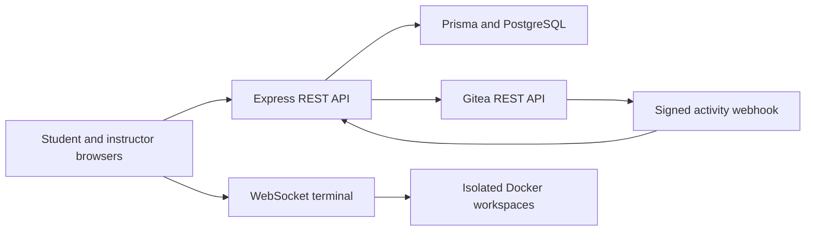

# GitStack

**A Git learning and collaboration lab for software engineering students.**

GitStack takes students from individual Git practice to a real, assessed team workflow. Students complete ordered missions in isolated Docker workspaces, receive repository-based feedback, and earn XP for independent work. Instructors can publish new individual missions, assign work, review progress, and manage Gitea-backed collaboration. The interface supports English and Bangla, plus light and dark themes.

> **Learning path:** Learn Git → practise in a safe workspace → collaborate through Gitea → submit evidence → receive feedback and XP.

## Contents

- [What GitStack includes](#what-gitstack-includes)
- [Architecture and technology](#architecture-and-technology)
- [Requirements](#requirements)
- [First-time setup](#first-time-setup)
- [Upgrade an existing installation](#upgrade-an-existing-installation)
- [Everyday use](#everyday-use)
- [Mission rules, timers, and XP](#mission-rules-timers-and-xp)
- [Team collaboration and assessment](#team-collaboration-and-assessment)
- [Configuration](#configuration)
- [Verification](#verification)
- [Project structure](#project-structure)
- [Security and troubleshooting](#security-and-troubleshooting)
- [Further documentation](#further-documentation)

## What GitStack includes

| Area | Available capabilities |
| --- | --- |
| Student learning | Individual Git missions, ordered steps, a live Docker terminal, repository-state validation, progress history, feedback, levels, XP, leaderboard, and milestone badges. |
| Mission authoring | Instructor-created and published individual missions with objectives, ordered steps, time estimates, XP rewards, and automatic validation rules. Protected built-in missions are also included. |
| Learning extras | **Git Flow Lab**, a guided visual simulation of ten Git commands with optional sound; and **Git Hangman**, a browser-based Git vocabulary game. |
| Teamwork | Three-person teams with Feature Developer, Test Developer, and Code Reviewer roles; a separate collaboration workspace for each student. |
| Gitea integration | Organization-owned private repositories, team access synchronization, branches, issues, pull requests, reviews, signed webhooks, and an instructor repository-management page. |
| Assessment | Repository evidence for individual missions; role and team evidence for collaboration; persisted results, Bangla feedback, activity reports, and XP. |
| Experience | Student and instructor dashboards, responsive layouts, English/Bangla language selection, and light/dark themes. |

The Git Flow Lab is an **interactive simulation**: it does not execute commands or award XP. Git Hangman likewise does not modify mission progress or account XP.

## Architecture and technology



| Layer | Technology |
| --- | --- |
| Frontend | HTML, CSS, vanilla JavaScript, xterm.js |
| Server | Node.js 20+, Express 5, Zod |
| Authentication and data | Argon2id, JWT in an HttpOnly cookie, encrypted profile fields |
| Database | PostgreSQL 17, Prisma 6 |
| Mission workspace | Docker containers running as a non-root user; WebSocket terminal |
| Collaboration | Gitea 1.24, REST API, organization repositories, signed webhooks |

The Node application runs on the host in the documented local setup. Docker Compose starts a PostgreSQL database for GitStack and a separate PostgreSQL database for Gitea. Individual mission containers have no network access; collaboration containers use a private network to reach Gitea. See [the architecture guide](docs/architecture.md) for the data and assessment flows.

## Requirements

- An Ubuntu host with **Node.js 20 or newer**, npm, Docker Engine, and Docker Compose.
- Permission to run Docker commands from the host terminal.
- Ports **3000** (GitStack), **3002** (Gitea HTTP), **2222** (Gitea SSH), and **5432** (GitStack PostgreSQL) available in the default Compose configuration.
- A Gitea administrator account and access token for the collaboration features.

Run the following setup commands in the **host terminal**. The browser mission terminal is only for student Git/Linux work inside its sandbox.

## First-time setup

These steps are for a **new installation with no existing GitStack database**. Extract the ZIP and enter the directory containing `package.json`.

```bash
cd /path/to/GitStack-Git-Flow-Lab-Complete/GitStack-main
unset DOCKER_HOST
unset DOCKER_CONTEXT
docker context use default
sudo systemctl enable --now docker
npm ci
cp .env.example .env
npm run setup -- --rebuild
```

`npm run setup` validates source and UI checks, generates local secrets when the environment file has placeholders, builds and tests the sandbox image, starts PostgreSQL/Gitea, deploys Prisma migrations, and seeds the built-in missions. Run it only when setting up a fresh database or intentionally repeating its setup and seed operations.

If the extracted ZIP already contains an `.env`, **keep it only with the database it belongs to**. On a genuinely fresh installation, create configuration from `.env.example` as above; for an existing installation, follow the upgrade instructions instead.

### Finish Gitea setup

1. Open [http://localhost:3002](http://localhost:3002), complete Gitea's one-time setup, and create an administrator account.
2. Generate an access token at [http://localhost:3002/user/settings/applications](http://localhost:3002/user/settings/applications) with `write:admin`, `write:organization`, `write:repository`, `write:issue`, and `read:user` scopes.
3. Set your own values in `.env` for `GITEA_ADMIN_TOKEN` and `GITEA_OWNER`. The owner is the Gitea administrator account used for setup; collaboration repositories are provisioned under the GitStack **organization**.
4. Ensure `GITEA_ORGANIZATION=gitstack`, or set the organization name intended for this installation. For the supplied Compose network, the webhook target is `http://host.docker.internal:3000/api/gitea/webhook`.
5. Verify the connection, then start the application:

```bash
npm run gitea:doctor
npm run dev
```

Open [http://localhost:3000](http://localhost:3000) for GitStack. `npm run dev` first checks the existing Docker volumes, services, Gitea database connection and Gitea API, then starts the development server with its file watcher. `npm start` runs the Node server without the file watcher. See [RUN_COMMANDS.md](RUN_COMMANDS.md) for the full first-run sequence and Gitea troubleshooting.

## Upgrade an existing installation

Keep the existing GitStack and Gitea databases/volumes. **Restore the previous working `.env` before starting the new code**, especially the original `DATA_ENCRYPTION_KEY`; changing it makes encrypted profiles unreadable. From the newly extracted project directory:

```bash
cd /path/to/GitStack-Git-Flow-Lab-Complete/GitStack-main
cp /path/to/previous/GitStack-main/.env .env
npm ci
docker compose up -d postgres gitea-db gitea
npm run db:validate
npm run db:generate
npm run db:deploy
npm run verify
npm run dev
```

The hint-XP migration is `20260928210000_dynamic_hint_xp`. It adds a nullable reward snapshot to mission attempts without rewriting historical XP. **Do not run `npm run db:seed` for a routine upgrade**; seeding is intended for fresh setup or deliberate restoration of built-in mission templates. Do not use `docker compose down -v` while preserving existing data.

Existing in-progress mission attempts keep their original deadline. **New attempts** use the mission's displayed estimated minutes for both the countdown and the individual mission sandbox expiry. More detail is in [RUN_COMMANDS.md](RUN_COMMANDS.md) and the [hint upgrade notes](docs/SYSTEM_COMMAND_HINTS_V35.md).

## Everyday use

Start the existing local services and application:

```bash
npm run project:start
```

`project:start` checks existing data volumes, waits for Compose services and the Gitea API, repairs a broken GitStack Compose network once when it is safe, checks the sandbox image, then starts GitStack. It does **not** apply pending database migrations; run `npm run db:deploy` when upgrading code that includes migrations.

| Destination | Local URL |
| --- | --- |
| GitStack | [localhost:3000](http://localhost:3000) |
| Gitea | [localhost:3002](http://localhost:3002) |
| Student dashboard | [student-dashboard.html](http://localhost:3000/student-dashboard.html) |
| Instructor dashboard | [instructor-dashboard.html](http://localhost:3000/instructor-dashboard.html) |
| Instructor Gitea management | [instructor-gitea.html](http://localhost:3000/instructor-gitea.html) |
| API health check | [`/api/health`](http://localhost:3000/api/health) |

Create accounts through GitStack's signup page, using the relevant student or instructor role. Student pages include Missions, Mission Workspace, Progress & XP, Assessment & Feedback, Team Activity, Profile, Git Flow Lab, and Git Hangman. Instructor pages include Missions, Assignments, Teams, Students, Assessments, Analytics, Activity, Gitea, Collaboration, and Profile.

## Mission rules, timers, and XP

### Individual missions

An instructor can create and publish an individual mission with **1–12 ordered steps**, an XP reward, a time estimate, and repository-state validation rules. The authoring form accepts estimates of **5–240 minutes**; when an individual mission has no estimate, the student mission card and a new attempt use **30 minutes**. Publication checks whether the steps can actually run in the mission terminal. Existing built-in missions follow the same individual mission runtime.

A student starts an attempt, performs the Git actions in an isolated workspace, and submits the resulting repository. Validation checks observable state such as required files, tracked changes, commits, branches, and a clean working tree. Steps must be completed in order. A reset restarts the workspace **without extending the attempt deadline**. The first successful completion claims the mission's XP; practice retries do not award that XP again.

For a new attempt, the **mission estimate is the attempt's countdown duration**. The linked individual Docker sandbox uses the same deadline, including for missions longer than the normal standalone sandbox lifetime. Already-running attempts created before this timer update retain their earlier deadlines, protecting their progress.

### Verified hints and dynamic XP

Hints are available only for the current unfinished step after the system verifies a useful command against the live repository. Each step's hint cost is based on the mission XP and ordered step count. Later steps carry gradually larger weights; integer costs always sum to the total mission reward.

| Example: 100 XP, eight steps | XP earned on first completion |
| --- | ---: |
| No hints | 100 |
| Hints on steps 1 and 8 (9 + 16 XP) | 75 |
| Hints on every step | 0 |

On a new attempt, revealing a hint reduces the **reward available when that attempt is completed**; it does not subtract XP previously earned elsewhere. An attempt completed entirely with hints can still pass and records **0 XP**. Reopening an already revealed hint is free. Attempts that paid the older immediate hint charge preserve their old accounting so those charges are not applied twice.

Read [the hint and XP specification](docs/SYSTEM_COMMAND_HINTS_V35.md) and [published mission authoring rules](docs/PUBLISHED_MISSION_RUNTIME_V33.md) for implementation and upgrade detail.

## Team collaboration and assessment

GitStack's prepared team scenario is **Collaboration Basics**. A team has exactly three members with distinct roles: **Feature Developer**, **Test Developer**, and **Code Reviewer**. Instructors can form and assign teams; eligible students can also create a team. Students link their own Gitea usernames in their GitStack profiles.

For an ACTIVE team assignment, GitStack provisions or repairs a private **organization-owned** Gitea repository, access for team members, an issue, role branches, prepared conflict/test files, and a signed webhook. Each student works in a separate collaboration sandbox and clone.

1. The Feature Developer commits on the assigned feature branch, opens an issue-linked pull request, and responds to requested changes.
2. The Test Developer records test evidence, opens an issue-linked pull request, and resolves the prepared merge conflict after the feature work merges.
3. The Code Reviewer requests changes, checks corrected work and test evidence, then approves the pull requests.
4. Gitea events and repository evidence feed GitStack's collaboration report and assessment.

The collaboration score combines **70 individual role points + 30 team workflow points**. The required workflow must be complete and the total score must reach at least **70** to pass. GitStack links to Gitea's real pull-request/review UI; it does not simulate approvals or merges. The full role sequence is in [RUN_COMMANDS.md](RUN_COMMANDS.md) and [Collaboration Complete](docs/COLLABORATION_COMPLETE.md).

## Configuration

The template [`.env.example`](.env.example) documents local defaults. Important settings are:

| Variable | Purpose |
| --- | --- |
| `DATABASE_URL` | GitStack PostgreSQL connection. |
| `JWT_SECRET` and `DATA_ENCRYPTION_KEY` | Session signing and encryption of profile fields; preserve the encryption key across upgrades. |
| `APP_ORIGIN` and `PORT` | Browser origin and GitStack server port. |
| `GITEA_BASE_URL` and `GITEA_INTERNAL_BASE_URL` | Host-facing Gitea URL and container-network Gitea URL. |
| `GITEA_ADMIN_TOKEN`, `GITEA_OWNER`, `GITEA_ORGANIZATION` | Gitea provisioning identity, token, and organization. |
| `GITEA_WEBHOOK_SECRET` and `GITEA_WEBHOOK_TARGET_URL` | Signature secret and callback address for activity events. |
| `SANDBOX_*` | Image, resource limits, container lifetime, cleanup, and networking configuration. |

Defaults in [docker-compose.yml](docker-compose.yml) are for a local laboratory environment. When changing database credentials or ports, update the corresponding environment configuration. Keep `.env` out of source control and public downloads.

## Verification

| Check | Command | What it covers |
| --- | --- | --- |
| Source and application regressions | `npm run verify` | Syntax, UI, mission behavior, assignments, collaboration, hints/XP, Git Hangman, and mission timers. |
| Published instructor missions | `npm run published-runtime:test` | Generated mission steps, repository setup, progress, and assessment. |
| Cross-mission workflow | `npm run cross-mission:e2e` | Local mission lifecycle and switching checks. |
| Prisma schema and migrations | `npm run db:validate`, `npm run db:deploy` | Database schema validation and pending migrations. |
| Gitea connectivity | `npm run gitea:doctor` | Local Gitea credentials, API access, and scopes. |
| Docker sandbox | `npm run sandbox:doctor`, `npm run sandbox:test` | Sandbox image and host runtime behavior. |
| Full host acceptance | `npm run acceptance:host` | Application, Docker, database, Gitea, and health checks on a configured host. |

`npm run verify` is a source/test-suite check; Docker, PostgreSQL, and Gitea still need the relevant host checks. `acceptance:host` also invokes the mission seed: use it on a clean/demo installation or when you intentionally want to refresh built-in templates, rather than as an unattended routine check against an existing database.

## Project structure

| Path | Responsibility |
| --- | --- |
| [`public/`](public/) | Student and instructor pages, shared theme/language UI, Git Flow Lab, and Git Hangman. |
| [`routes/`](routes/) | Student, instructor, sandbox, Gitea, and webhook HTTP endpoints. |
| [`services/student/`](services/student/) | Mission setup, step engine, hints, XP scheduling, and repository validation. |
| [`services/sandbox/`](services/sandbox/) | Docker lifecycle, WebSocket terminal, isolation, and cleanup. |
| [`services/collaboration/`](services/collaboration/) | Gitea provisioning, role workflow, event handling, and team assessment. |
| [`prisma/`](prisma/) | Database schema, migrations, and seed data. |
| [`scripts/`](scripts/) | Setup, doctors, acceptance checks, and regression tests. |
| [`docs/`](docs/) | Architecture, deployment, API, mission design, and feature-specific guidance. |
| [`server.js`](server.js) | Express server, authentication, route mounting, and WebSocket gateway. |

## Security and troubleshooting

- Passwords are hashed with Argon2id. Session cookies are HttpOnly; profile fields use encrypted storage and lookup hashes.
- Student commands run inside limited Docker containers, without a host-project mount or Docker socket. Individual sandboxes have no network; team sandboxes use the restricted collaboration network.
- Gitea webhooks require a valid HMAC signature before events are recorded.
- Never commit or share `.env`, `GITEA_ADMIN_TOKEN`, `JWT_SECRET`, `GITEA_WEBHOOK_SECRET`, or `DATA_ENCRYPTION_KEY`. Preserve the original encryption key when reusing an existing database.
- A Gitea **401** usually points to an invalid or expired token; a **403** can indicate missing scopes. Update `.env`, restart Node, then run `npm run gitea:doctor`.
- If Docker points to a Podman socket, unset `DOCKER_HOST` and `DOCKER_CONTEXT`, select the default Docker context, and check `docker ps`.
- Do not remove Docker volumes during a normal upgrade. For additional diagnostics, see [RUN_COMMANDS.md](RUN_COMMANDS.md).

## Further documentation

- [Sequential run, upgrade, and demo guide](RUN_COMMANDS.md)
- [Architecture](docs/architecture.md)
- [Deployment guide](docs/deployment-guide.md)
- [API documentation](docs/api-documentation.md)
- [Mission design](docs/mission-design.md)
- [Published mission runtime and authoring](docs/PUBLISHED_MISSION_RUNTIME_V33.md)
- [System hints and dynamic XP](docs/SYSTEM_COMMAND_HINTS_V35.md)
- [Git Hangman](docs/GIT_HANGMAN_V36.md)
- [Collaboration workflow](docs/COLLABORATION_COMPLETE.md)
- [Contributing](CONTRIBUTING.md)
