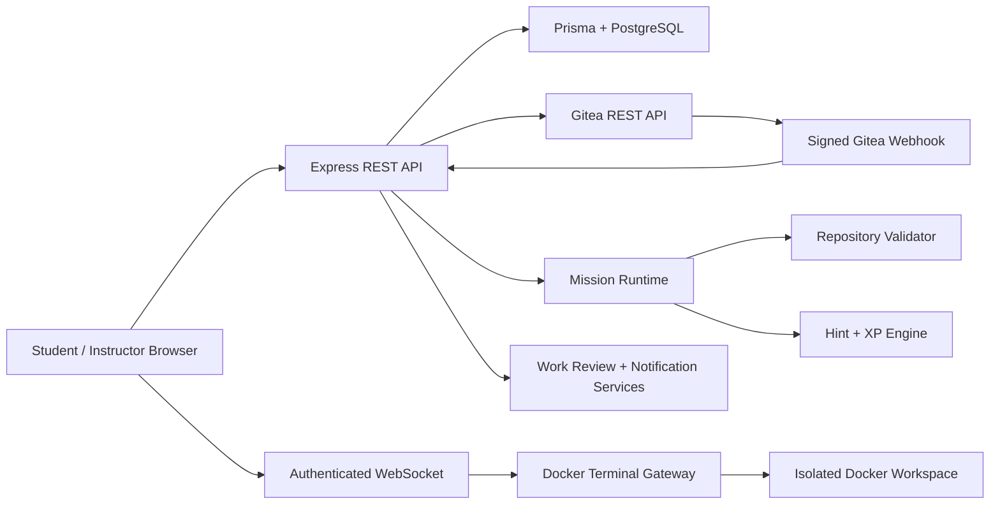

# GitStack

**GitStack is an interactive Git learning and collaboration platform for software engineering students.**

It combines structured Git missions, isolated Docker workspaces, repository-state assessment, instructor-authored missions, Gitea-based team collaboration, hints and XP, progress tracking, feedback, and interactive Git learning tools in one system.

> **Learning path:** Learn Git → Practise Safely → Work in Teams → Follow a Real Workflow → Receive Automatic Assessment

---

## Table of Contents

- [Project Overview](#project-overview)
- [Core Features](#core-features)
- [Learning Flow](#learning-flow)
- [Mission System](#mission-system)
- [Instructor-Created Missions](#instructor-created-missions)
- [Hints and Dynamic XP](#hints-and-dynamic-xp)
- [Git Flow Lab](#git-flow-lab)
- [Git Hangman](#git-hangman)
- [Team Collaboration](#team-collaboration)
- [Work Reviews and Notifications](#work-reviews-and-notifications)
- [Architecture](#architecture)
- [Technology Stack](#technology-stack)
- [Requirements](#requirements)
- [Fresh Installation](#fresh-installation)
- [Gitea Configuration](#gitea-configuration)
- [Upgrading an Existing Installation](#upgrading-an-existing-installation)
- [Daily Development](#daily-development)
- [Verification and Testing](#verification-and-testing)
- [Project Structure](#project-structure)
- [Security](#security)
- [Important Operational Rules](#important-operational-rules)
- [Troubleshooting](#troubleshooting)
- [Documentation](#documentation)

---

## Project Overview

GitStack is designed to teach Git through **actual repository operations rather than only theoretical instructions**.

Students can:

- learn Git concepts through structured learning pages;
- start individual missions with ordered steps;
- practise Git commands inside isolated Docker workspaces;
- receive state-aware hints;
- earn XP based on independent completion;
- submit repository evidence for assessment;
- participate in a real Gitea-based collaboration workflow;
- request private instructor feedback;
- use Git Flow Lab and Git Hangman as additional learning tools.

Instructors can:

- create and publish individual missions;
- define ordered steps and automatic validation rules;
- assign missions to students or teams;
- manage teams and Gitea repositories;
- review student progress and assessment results;
- provide private work-review feedback;
- monitor activity and analytics.

The system supports **English/Bangla language controls** and **light/dark themes** across the student and instructor experiences.

---

# Core Features

| Area | Features |
| --- | --- |
| **Student Learning** | Git lessons, individual missions, ordered steps, live terminal, progress, XP, levels, leaderboard, badges, assessment and feedback |
| **Mission Runtime** | Built-in missions and instructor-created published missions, repository preparation, command gating, repository-state validation and progress tracking |
| **Mission Authoring** | 1–12 ordered steps, XP reward, estimated duration, automatic validation rules and optional instructor Clues |
| **Hints** | Three-layer, state-aware hints: Clue → Guidance → Answer |
| **XP** | Deterministic step budgets and hint costs; unused mission reward is preserved |
| **Git Flow Lab** | Interactive visual simulation of ten Git commands with replay, before/after states and optional sound |
| **Git Hangman** | Git vocabulary learning game |
| **Team Collaboration** | Three-person role-based collaboration workflow using Gitea |
| **Gitea** | Private organization repositories, branches, issues, pull requests, reviews and signed webhooks |
| **Work Reviews** | Private contribution-review requests, repository evidence, instructor feedback and review history |
| **Notifications** | Dashboard notification bell, unread state, read controls and assignment/review notifications |
| **Security** | Argon2id password hashing, HttpOnly session cookie, encrypted profile fields, HMAC webhook verification and isolated Docker sandboxes |
| **UI** | Responsive student/instructor dashboards, English/Bangla controls and light/dark themes |

---

# Learning Flow

```text
                    ┌─────────────────────┐
                    │      Learn Git      │
                    └──────────┬──────────┘
                               │
                               ▼
                    ┌─────────────────────┐
                    │ Practise Safely     │
                    │ Docker Mission      │
                    └──────────┬──────────┘
                               │
                               ▼
                    ┌─────────────────────┐
                    │ Automatic           │
                    │ Repository          │
                    │ Assessment          │
                    └──────────┬──────────┘
                               │
                 ┌─────────────┴─────────────┐
                 ▼                           ▼
       ┌─────────────────┐         ┌──────────────────┐
       │ Individual      │         │ Team Collaboration│
       │ Missions        │         │ through Gitea     │
       └─────────────────┘         └──────────────────┘
```

---

# Mission System

GitStack supports two sources of individual missions:

1. **Built-in missions** shipped with the system.
2. **Instructor-created missions** that are saved, published and executed through the same individual mission runtime.

An individual mission can contain:

- **1–12 ordered steps**
- an XP reward
- an estimated duration
- repository-state validation rules
- optional instructor-authored Clues

The mission engine is repository-state based. A student is not required to use one exact command when multiple valid Git commands can produce the required state, unless the mission explicitly defines a command contract.

Typical validation targets include:

- repository initialization;
- required files;
- tracked files;
- commits;
- commit-message requirements;
- branch names or prefixes;
- final branch;
- clean working tree;
- other observable repository state.

### Sequential execution

Mission steps are completed in order.

```text
Step 1
  ↓
Step 2
  ↓
Step 3
  ↓
...
  ↓
Final Assessment
```

The terminal checks the active step before accepting mission progress. Successful command evidence is associated with the active mission run.

### Mission timer

For a new individual mission attempt:

- the mission's estimated duration becomes the attempt countdown;
- the linked individual sandbox uses the same deadline;
- resetting an attempt does **not** extend its deadline;
- existing attempts retain their original deadline when the timer system is upgraded.

The default estimate for an individual mission without an explicit estimate is **30 minutes**.

---

# Instructor-Created Missions

A major GitStack capability is the ability for instructors to create and publish new individual missions without adding a new hard-coded mission implementation.

The runtime follows this flow:

```text
Instructor creates mission
        │
        ▼
Ordered mission steps
        │
        ▼
Automatic publication checks
        │
        ▼
Mission contract
        │
        ▼
Student starts attempt
        │
        ▼
Mission workspace is prepared
        │
        ▼
Terminal command execution
        │
        ▼
Step evidence + repository state
        │
        ▼
Progress and final assessment
```

### Authoring rules

For reliable missions:

- write **one observable Git action per step**;
- keep steps in execution order;
- define a required filename or branch prefix when the exact name matters;
- use automatic validation rules for repository-state requirements;
- ensure every published step has a runnable action.

Examples of good step progression:

```text
1. Inspect repository status
2. Create README.md
3. Stage README.md
4. Commit the change
5. Verify the working tree is clean
```

A compound instruction should be avoided when the student would benefit from observing separate state changes.

### Repository preparation

The published mission runtime prepares the initial repository according to the mission's first required action.

Examples:

- A mission beginning with `git init` can start without an existing repository.
- A mission that begins by inspecting an existing repository or creating a feature branch starts with a prepared `main` branch and starter commit.
- A mission requiring pending changes can receive a prepared starter file.

Remote clone/push/pull workflows should use the collaboration workflow when a prepared remote is required; the individual mission form does not configure an external remote source.

### Runtime verification

The project includes:

```bash
npm run published-runtime:test
```

This verifies instructor-published mission compilation/runtime behavior, repository setup, command sequencing, progress and final assessment using isolated temporary Git repositories.

---

# Hints and Dynamic XP

GitStack uses a **three-layer, state-aware hint system** for the current unfinished mission step.

| Layer | Purpose |
| --- | --- |
| **1 — Clue** | A simple indication of the next action |
| **2 — Guidance** | More specific operation and target guidance |
| **3 — Answer** | The verified command or command sequence |

Layers unlock sequentially.

The server checks:

- the current mission step;
- the student's live repository state;
- the command gate;
- whether the requested hint is valid for the current state.

A hint is not charged when the system cannot reliably determine a valid answer.

### Instructor Clues

Instructors can optionally provide a first-layer Clue when creating or editing an individual mission.

The system still generates:

- Guidance;
- Answer.

The optional Clue does not change XP costs.

---

## XP calculation

Mission XP is distributed across ordered steps using deterministic weighted allocation.

For a mission reward `R` and `N` steps, later steps receive progressively larger step budgets. Each step's budget is then divided across the three hint layers using weights:

```text
Layer 1 : Layer 2 : Layer 3
    1   :    2    :    3
```

Integer rounding preserves the exact mission reward.

For example, a 14-XP step may cost:

```text
Layer 1 = 2 XP
Layer 2 = 5 XP
Layer 3 = 7 XP

Total = 14 XP
```

Using a hint reduces the XP **available from that mission attempt**. It does not remove XP previously earned elsewhere.

If all available hint layers are used, the attempt can still be successfully completed, but the remaining mission reward may be zero.

Previously purchased hints remain available after page reloads and workspace resets, and reopening a purchased layer is free.

---

# Git Flow Lab

Git Flow Lab is an interactive visual Git simulator.

It demonstrates ten Git commands using explicit before/after repository states:

```text
git init -b main
git clone
git status
git add app.js
git commit
git push origin main
git pull --ff-only origin main
git branch feature/login
git checkout feature/login
git merge feature/login
```

The lab visualizes:

- working files;
- index/staging state;
- commits;
- branches;
- `HEAD`;
- remote-tracking references;
- file snapshots;
- command-specific before/after state.

It also supports:

- replay;
- speed controls;
- sound;
- volume;
- English/Bangla;
- responsive layouts.

**Important:** Git Flow Lab is a simulation. It does not execute commands in the student's mission sandbox and does not award XP.

Verification:

```bash
npm run flow-lab:test
```

---

# Git Hangman

Git Hangman is a browser-based Git vocabulary game.

It is designed as an additional learning activity rather than a mission execution environment.

Git Hangman:

- does not modify mission progress;
- does not modify mission attempts;
- does not award mission XP.

---

# Team Collaboration

GitStack includes a prepared **Collaboration Basics** team workflow using Gitea.

Each team has exactly three roles:

| Role | Main responsibility |
| --- | --- |
| **Feature Developer** | Feature branch, commits, issue-linked pull request and requested changes |
| **Test Developer** | Test evidence, test branch, pull request and deterministic conflict resolution |
| **Code Reviewer** | Review, requested changes, verification and final approval/merge discipline |

### Collaboration workflow

```text
Team assignment
      ↓
Gitea repository provisioning
      ↓
Role branches + issue + prepared files
      ↓
Feature work
      ↓
Pull Request
      ↓
Review / requested changes
      ↓
Test work
      ↓
Conflict resolution
      ↓
Testing evidence
      ↓
Final review
      ↓
Assessment
```

GitStack provisions or repairs the organization-owned private Gitea repository for an active team assignment.

The collaboration workflow uses:

- real branches;
- real commits;
- real issues;
- real pull requests;
- real reviews;
- signed Gitea webhooks;
- repository evidence.

It does **not** simulate GitHub/Gitea approval or merge actions.

### Assessment

The collaboration score contains:

```text
70 individual role points
+
30 shared team workflow points
=
100 total points
```

The workflow must be complete and the final score must reach at least **70** to pass.

---

# Work Reviews and Notifications

Students can request private instructor feedback on their own team contribution.

### Student workflow

1. Push work to the assigned team repository.
2. Open **Work reviews** or **Request instructor review**.
3. Select the team repository and optional assignment.
4. Describe the contribution and questions.
5. Select a branch, commit SHA or Pull Request number.
6. Optionally specify repository-relative files.
7. Submit the review request.
8. Read the instructor's outcome and feedback.

### Instructor workflow

Instructors can:

- inspect the submitted contribution;
- inspect the saved Git snapshot;
- open submitted changes in Gitea;
- mark a review as:
  - **Reviewed**
  - **Approved**
  - **Changes requested**
- provide written feedback.

Review access is private to the relevant student and instructor.

### Notifications

Dashboard notifications support:

- unread count;
- notification history;
- individual read state;
- Mark all read;
- pagination;
- assignment notifications;
- review notifications.

Notifications do not modify:

- mission XP;
- automatic mission assessment;
- Gitea files;
- collaboration assessment.

---

# Architecture



### Runtime boundaries

**Host application**

- Node.js / Express
- authentication
- REST APIs
- WebSocket gateway
- mission orchestration
- assessment
- Gitea integration

**GitStack PostgreSQL**

- users
- missions
- mission attempts
- hints
- XP
- assignments
- collaboration metadata
- reviews
- notifications

**Gitea PostgreSQL**

- Gitea's own application data

**Docker sandbox**

- isolated student workspace
- Git/Bash tools
- non-root student account
- terminal PTY
- resource limits
- cleanup/expiration

Individual mission sandboxes have no network access. Collaboration sandboxes use the restricted collaboration network required to reach Gitea.

---

# Technology Stack

| Layer | Technology |
| --- | --- |
| Frontend | HTML, CSS, vanilla JavaScript |
| Terminal | xterm.js + authenticated WebSocket |
| Backend | Node.js 20+, Express 5 |
| Validation | Zod + repository-state validation |
| Authentication | JWT + HttpOnly cookie |
| Password hashing | Argon2id |
| Database | PostgreSQL 17 |
| ORM | Prisma 6 |
| Sandbox | Docker |
| Collaboration | Gitea 1.24 |
| API integration | REST + signed webhooks |
| Source control | Git |

---

# Requirements

For the documented local environment:

- Ubuntu/Linux host
- Node.js **20 or newer**
- npm
- Docker Engine
- Docker Compose
- permission to run Docker commands
- Gitea administrator account and access token

Default ports:

| Service | Port |
| --- | ---: |
| GitStack | `3000` |
| Gitea HTTP | `3002` |
| Gitea SSH | `2222` |
| GitStack PostgreSQL | `5432` |

---

# Fresh Installation

These steps are for a **new GitStack installation with no existing GitStack database**.

Extract the project and enter the directory containing `package.json`.

```bash
cd /path/to/GitStack-main

unset DOCKER_HOST
unset DOCKER_CONTEXT

docker context use default
sudo systemctl enable --now docker

npm ci
cp .env.example .env

npm run setup -- --rebuild
```

### Why `npm ci`?

The project archive intentionally does not contain `node_modules`.

Use:

```bash
npm ci
```

rather than copying an old `node_modules` directory between machines.

This restores the exact dependency versions from `package-lock.json` and restores executable local tools such as:

```text
node_modules/.bin/nodemon
node_modules/.bin/prisma
```

### What setup does

`npm run setup -- --rebuild`:

- validates source;
- checks UI and feature behavior;
- checks student/instructor functionality;
- checks sandbox configuration;
- builds the sandbox image;
- starts PostgreSQL/Gitea;
- validates and generates Prisma;
- deploys migrations;
- seeds built-in mission templates.

Use setup for a fresh installation or an intentional restoration of built-in seed data.

---

# Gitea Configuration

After the initial setup:

1. Open:

```text
http://localhost:3002
```

2. Complete Gitea's one-time setup.
3. Create an administrator account.
4. Create an access token with the required administration, organization, repository, issue and user-read permissions.
5. Put the token and owner information in `.env`.

Important settings include:

```env
GITEA_BASE_URL=http://localhost:3002
GITEA_INTERNAL_BASE_URL=http://gitstack-gitea:3000
GITEA_ADMIN_TOKEN=your_token
GITEA_OWNER=your_gitea_admin
GITEA_ORGANIZATION=gitstack
GITEA_WEBHOOK_SECRET=your_webhook_secret
GITEA_WEBHOOK_TARGET_URL=http://host.docker.internal:3000/api/gitea/webhook
```

Then verify:

```bash
npm run gitea:doctor
```

Start GitStack:

```bash
npm run dev
```

Open:

```text
http://localhost:3000
```

---

# Upgrading an Existing Installation

For an existing installation, **preserve the existing databases, Docker volumes and `.env`**.

The most important value to preserve is:

```text
DATA_ENCRYPTION_KEY
```

Changing it can make existing encrypted profile data unreadable.

From the new project directory:

```bash
unset DOCKER_HOST
unset DOCKER_CONTEXT
docker context use default

npm ci

docker compose up -d postgres gitea-db gitea

npm run db:validate
npm run db:generate
npm run db:deploy

npm run verify
npm run dev
```

### Do not do this during a normal upgrade

```bash
docker compose down -v
```

The `-v` option removes named volumes and can destroy the existing local database state.

### Do not reseed unnecessarily

Do not run:

```bash
npm run db:seed
```

during a normal upgrade.

Seeding is intended for fresh setup or an intentional restoration of built-in mission templates.

---

# Daily Development

For an existing configured installation:

```bash
npm run dev
```

The development startup performs the project's preflight checks before starting the Node server.

An alternative managed startup is:

```bash
npm run project:start
```

This checks the existing infrastructure, Docker context, persistent volumes, PostgreSQL/Gitea availability and sandbox image before starting GitStack.

### Useful local URLs

| Destination | URL |
| --- | --- |
| GitStack | `http://localhost:3000` |
| Gitea | `http://localhost:3002` |
| Student dashboard | `http://localhost:3000/student-dashboard.html` |
| Instructor dashboard | `http://localhost:3000/instructor-dashboard.html` |
| Instructor Gitea | `http://localhost:3000/instructor-gitea.html` |
| API health | `http://localhost:3000/api/health` |

---

# Verification and Testing

GitStack contains a large regression suite.

## Main verification

```bash
npm run verify
```

This includes checks for:

- source syntax;
- startup behavior;
- UI;
- student dashboard;
- instructor dashboard;
- mission assignments;
- collaboration;
- collaboration synchronization;
- sandbox/terminal behavior;
- hints;
- XP;
- mission timers;
- Git Flow Lab;
- instructor Clues;
- work reviews;
- notifications.

## Mission-specific tests

### Published mission runtime

```bash
npm run published-runtime:test
```

Tests:

- instructor-created mission compilation;
- starter repository preparation;
- command sequencing;
- progress from 0–100%;
- pending work correction;
- final assessment.

### Mission lifecycle

```bash
npm run mission-lifecycle:test
npm run cross-mission:e2e
```

### Mission command behavior

```bash
npm run command-behavior:e2e
npm run runtime-mission:test
npm run runtime-completion:test
npm run universal-mission:test
```

### Mission terminal and synchronization

```bash
npm run mission-terminal-wiring:test
npm run mission-prompt:test
npm run live-ui-sync:test
npm run branching-reset:test
npm run branching-cwd:test
```

### Hints and XP

```bash
npm run mission-hints:test
npm run hint-xp:test
```

### Git Flow Lab

```bash
npm run flow-lab:test
```

### Git Hangman

```bash
npm run hangman:test
```

### Work reviews

```bash
npm run reviews:test
```

### Docker sandbox

```bash
npm run sandbox:doctor
npm run sandbox:test
npm run terminal:test
```

### Gitea

```bash
npm run gitea:doctor
```

### Full host acceptance

```bash
npm run acceptance:host
```

`acceptance:host` is an environment-level check. It requires a correctly configured `.env`, Docker, PostgreSQL, Gitea and the sandbox image.

---

# Project Structure

```text
GitStack-main/
│
├── public/
│   ├── student-*.html/js
│   ├── instructor-*.html/js
│   ├── sandbox-terminal.*
│   ├── git-hangman.*
│   ├── git-command-visualizer.*
│   ├── theme.*
│   └── language.js
│
├── routes/
│   ├── student-routes.js
│   ├── instructor-routes.js
│   ├── sandbox-routes.js
│   ├── gitea-routes.js
│   ├── gitea-webhook-routes.js
│   └── work-review-routes.js
│
├── services/
│   ├── student/
│   │   ├── mission-setup-service.js
│   │   ├── mission-step-engine.js
│   │   ├── mission-terminal-policy.js
│   │   ├── mission-validator-service.js
│   │   ├── published-mission-contract.js
│   │   ├── mission-hint-service.js
│   │   └── mission-hint-xp.js
│   │
│   ├── sandbox/
│   │   ├── sandbox-service.js
│   │   ├── container-service.js
│   │   ├── terminal-manager.js
│   │   ├── terminal-gateway.js
│   │   └── cleanup-service.js
│   │
│   ├── collaboration/
│   ├── gitea/
│   ├── reviews/
│   ├── leaderboard/
│   └── security/
│
├── prisma/
│   ├── schema.prisma
│   ├── seed.js
│   └── migrations/
│
├── scripts/
│   ├── setup-project.js
│   ├── start-project.js
│   ├── final-acceptance.js
│   ├── gitea-doctor.js
│   ├── sandbox-doctor.js
│   └── test-*.js
│
├── docs/
│   ├── architecture.md
│   ├── api-documentation.md
│   ├── deployment-guide.md
│   ├── mission-design.md
│   ├── PUBLISHED_MISSION_RUNTIME_V33.md
│   ├── THREE_LAYER_HINTS_AND_FLOW_LAB.md
│   ├── WORK_REVIEWS_AND_NOTIFICATIONS.md
│   └── ...
│
├── docker-compose.yml
├── Dockerfile
├── package.json
├── package-lock.json
├── RUN_COMMANDS.md
└── README.md
```

---

# Security

GitStack includes several security boundaries.

### Authentication

- Passwords use Argon2id.
- Sessions use JWT-based authentication.
- Session cookies are HttpOnly.
- Authentication-protected endpoints validate ownership and role.

### Profile data

Selected profile fields are encrypted using AES-256-GCM-compatible configuration.

The encryption key is:

```text
DATA_ENCRYPTION_KEY
```

**Preserve this key when upgrading an existing database.**

### Sandbox isolation

Individual student commands run inside Docker containers:

- non-root student account;
- temporary workspace;
- resource limits;
- command timeout;
- process limit;
- workspace size limit;
- no host-project mount;
- no Docker socket;
- isolated network profile;
- automatic expiration and cleanup.

### Gitea security

Gitea activity webhooks require a valid HMAC signature.

Never commit:

```text
.env
GITEA_ADMIN_TOKEN
JWT_SECRET
GITEA_WEBHOOK_SECRET
DATA_ENCRYPTION_KEY
```

---

# Important Operational Rules

### 1. Always verify the Docker context

If Docker is pointing to another engine:

```bash
unset DOCKER_HOST
unset DOCKER_CONTEXT
docker context use default
```

Then:

```bash
docker ps
```

### 2. Preserve existing volumes

Do not use:

```bash
docker compose down -v
```

when you need to preserve GitStack/Gitea data.

### 3. Preserve `.env`

For an existing database, restore the `.env` from the previous working installation before starting the new version.

### 4. Use `npm ci` after extracting a clean project archive

Do not copy `node_modules` from another machine.

### 5. Apply migrations before starting upgraded code

```bash
npm run db:validate
npm run db:generate
npm run db:deploy
```

### 6. Do not use the browser mission terminal for host setup

Commands such as:

```bash
npm ci
docker ps
npm run db:deploy
```

belong in the **host terminal**, not inside the student's browser mission sandbox.

---

# Troubleshooting

## `nodemon: Permission denied`

The project archive does not include `node_modules`.

From the project root:

```bash
rm -rf node_modules
npm ci
npm run dev
```

Using `npm ci` restores the local executable links from the lockfile.

Avoid copying `node_modules` from another operating system or machine.

---

## Prisma executable or `.wasm` errors

If Prisma reports a missing file under:

```text
node_modules/.bin/
```

rebuild the local dependencies:

```bash
rm -rf node_modules
npm ci
npm run db:generate
npm run db:validate
```

This does not delete PostgreSQL data.

---

## Docker is using the wrong context

Run:

```bash
unset DOCKER_HOST
unset DOCKER_CONTEXT
docker context use default
sudo systemctl enable --now docker
docker ps
```

Do not delete containers or volumes merely because the Docker context is wrong.

---

## Gitea returns 401

Usually:

- invalid token;
- expired token;
- wrong `.env` value.

Check:

```bash
npm run gitea:doctor
```

---

## Gitea returns 403

Usually the token does not have the required permissions.

Verify the configured Gitea token and required scopes, then restart GitStack.

---

## GitStack refuses to start because a volume is missing

This is intentional.

The startup safety checks refuse to silently create a fresh empty database when the expected existing Docker volume is unavailable.

First verify:

```bash
docker context use default
docker volume ls
```

Do not create a new database blindly if the existing project data is expected to be present.

---

# Documentation

The repository contains detailed documentation for individual subsystems.

| Document | Purpose |
| --- | --- |
| [`RUN_COMMANDS.md`](RUN_COMMANDS.md) | Setup, upgrade and operational command sequence |
| [`docs/architecture.md`](docs/architecture.md) | System architecture and data flow |
| [`docs/deployment-guide.md`](docs/deployment-guide.md) | Deployment and environment guidance |
| [`docs/api-documentation.md`](docs/api-documentation.md) | API reference |
| [`docs/mission-design.md`](docs/mission-design.md) | Mission authoring and validation model |
| [`docs/PUBLISHED_MISSION_RUNTIME_V33.md`](docs/PUBLISHED_MISSION_RUNTIME_V33.md) | Instructor-published mission runtime and authoring rules |
| [`docs/THREE_LAYER_HINTS_AND_FLOW_LAB.md`](docs/THREE_LAYER_HINTS_AND_FLOW_LAB.md) | Three-layer hints, XP and Git Flow Lab |
| [`docs/WORK_REVIEWS_AND_NOTIFICATIONS.md`](docs/WORK_REVIEWS_AND_NOTIFICATIONS.md) | Work reviews and dashboard notifications |
| [`docs/COLLABORATION_COMPLETE.md`](docs/COLLABORATION_COMPLETE.md) | Gitea collaboration workflow |
| [`docs/GIT_HANGMAN_V36.md`](docs/GIT_HANGMAN_V36.md) | Git Hangman |
| [`docs/DOCKER_SANDBOX_COMPLETE.md`](docs/DOCKER_SANDBOX_COMPLETE.md) | Docker sandbox architecture |
| [`docs/SYSTEM_COMMAND_HINTS_V35.md`](docs/SYSTEM_COMMAND_HINTS_V35.md) | Hint system implementation and upgrade notes |
| [`CONTRIBUTING.md`](CONTRIBUTING.md) | Contribution workflow |

---

# Project Status

The current project includes the complete GitStack learning platform foundation with:

- individual Git missions;
- instructor-created published missions;
- automatic repository-state validation;
- isolated Docker terminal workspaces;
- three-layer state-aware hints;
- dynamic XP;
- Git Flow Lab;
- Git Hangman;
- student and instructor dashboards;
- mission assignments;
- Gitea team collaboration;
- automated collaboration assessment;
- private work reviews;
- dashboard notifications;
- English/Bangla controls;
- light/dark themes;
- source, integration and runtime regression tests.

For a fresh installation, follow [Fresh Installation](#fresh-installation).

For an existing GitStack database, follow [Upgrading an Existing Installation](#upgrading-an-existing-installation) and preserve the original `.env`, Docker volumes and `DATA_ENCRYPTION_KEY`.
